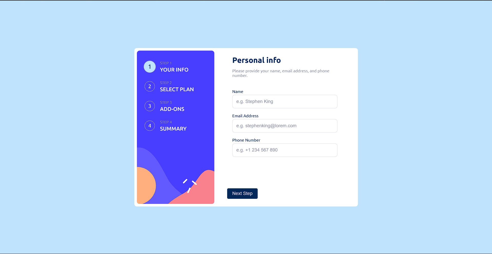

# Frontend Mentor - Multi-step Form Solution

This is my solution to the [Multi-step Form challenge on Frontend Mentor](https://www.frontendmentor.io/challenges/multistep-form-YVAnSdqQBJ). This project involves creating a multi-step form with dynamic interactions, form validation, and responsive design.

## 🚀 Live Demo

- **Live Site:** [Click here](https://sunilbaghel002.github.io/Multi-step-form/)
- **Frontend Mentor Solution:** [View Solution](https://www.frontendmentor.io/solutions/multi-step-form-solution-amb6e2Vkq1)
- **GitHub Repository:** [View Code](https://github.com/SunilBaghel002/Multi-step-form)

## 📸 Screenshot



## 🛠️ Built With

- **HTML5** – Semantic markup for better accessibility and structure
- **CSS3** – Custom properties, variables, flexbox, keyframes, and media queries for styling
- **JavaScript (ES6+)** – Handling form validation, step navigation, and dynamic interactions

## 📝 Features

- 📌 Multi-step navigation with smooth transitions
- ✅ Form validation for user input
- 📱 Fully responsive design using CSS media queries
- 🎨 Interactive UI with modern styling
- 🔄 Animated transitions using CSS keyframes

## 🔧 Installation & Usage

1. Clone the repository:
   ```sh
   git clone https://github.com/SunilBaghel002/Multi-step-form.git
   ```
2. Navigate to the project folder:
   ```sh
   cd Multi-step-form
   ```
3. Open `index.html` in your browser or use Live Server in VS Code.

## 💡 Lessons Learned

Through this project, I improved my skills in:
- Managing multi-step forms efficiently using JavaScript.
- Implementing form validation to enhance user experience.
- Utilizing CSS variables and keyframes for advanced styling.
- Enhancing mobile responsiveness with media queries.

## 📌 Future Improvements

- Add real-time error handling for form fields.
- Implement localStorage/sessionStorage to retain user input.
- Enhance UI animations for a smoother experience.
- Convert to a React-based implementation for better scalability.

---

### 🎯 Let's Connect!
- **Frontend Mentor:** [@SunilBaghel002](https://www.frontendmentor.io/profile/SunilBaghel002)
- **GitHub:** [SunilBaghel002](https://github.com/SunilBaghel002)
- **LinkedIn:** [Sunil Baghel](https://www.linkedin.com/in/sunil-baghel-140a60348/)

Happy coding! 🚀🚀🚀

